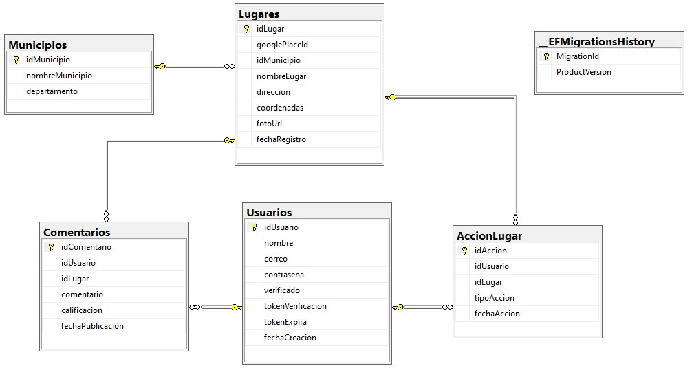
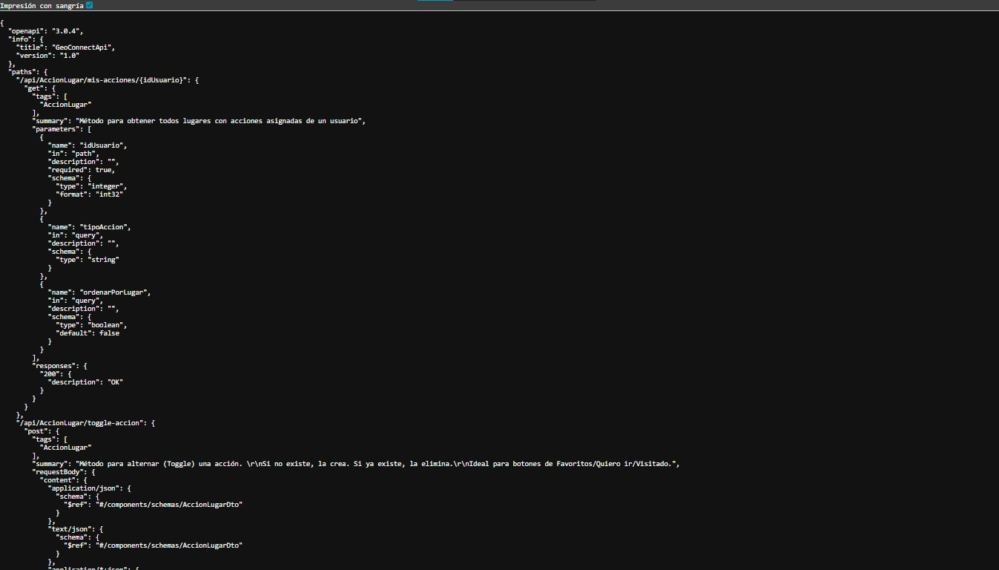

# GeoConnect Backend

## Información del Proyecto
API REST construida para el backend de la aplicación móvil GeoConnect.

**Estructura de la Solución:**
* **GeoConnectApi:** Controladores y configuración principal.
* **Services:** Lógica de negocio y acceso a datos.
* **Models:** Entidades y Contexto de Base de Datos.
* **AutofillGooglePlacesID:** Service worker para hacer un chequeo frecuente sobre la integridad de los datos relacionados a los lugares en la base de datos.

---

## Tecnologías y Sistemas
* **Framework:** .NET 9 (Web API)
* **Base de Datos:** SQL Server
* **ORM:** Entity Framework Core
* **Datos Espaciales:** NetTopologySuite
* **Autenticación:** JWT (JSON Web Tokens)

---

## Instrucciones de Ejecución
Para ejecutar el proyecto localmente, sigue los siguientes pasos:

1. Clonar el repositorio en tu máquina local.
2. Configurar la cadena de conexión de tu base de datos SQL Server en el archivo `GeoConnectApi/appsettings.json`.
3. Abrir la Consola del Administrador de Paquetes en Visual Studio (asegurando que el proyecto predeterminado sea donde están tus migraciones) y ejecutar:
   `Update-Database` (para aplicar las migraciones y generar la base de datos).
4. Ejecutar el proyecto presionando F5 en Visual Studio.

---

## Documentación y Esquemas
Toda la documentación técnica adicional, scripts y esquemas se encuentran en la carpeta `Docs` ubicada en la raíz del repositorio. 

A continuación se detalla el contenido de dicha carpeta:

### Esquema de la Base de Datos
Diagrama relacional del modelo de datos implementado:

*(Nota: Si por alguna razón la imagen no se visualiza desde tu navegador, dirígete directamente a la carpeta Docs en el repositorio para abrir el archivo).*

### Documentación de la API (Swagger)
La especificación técnica de los endpoints y los esquemas de respuesta está generada mediante Swagger. 

Para revisar la configuración de las rutas, parámetros y autorizaciones, puedes dirigirte a la carpeta `Docs` y revisar el archivo `swagger.json`. Este archivo contiene toda la estructura de la API y puede ser importado en visores web de Swagger o en herramientas de prueba de APIs como Postman.

